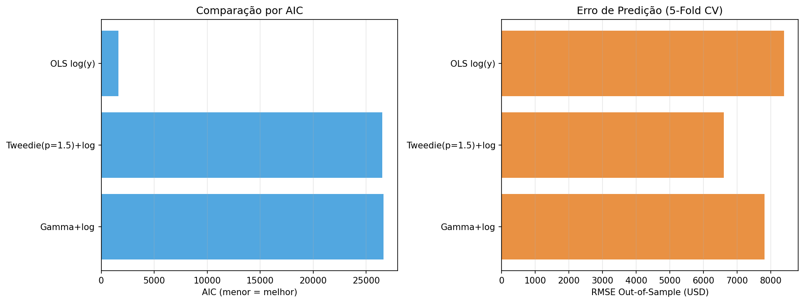
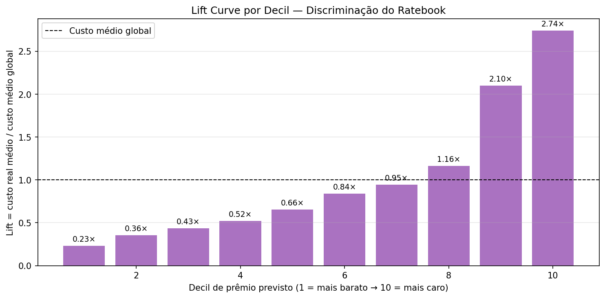
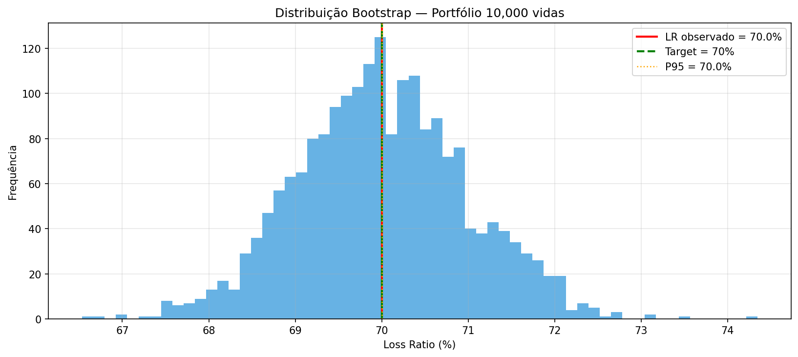

# Tarifação Seguro Saúde — Decisão CFO

## Recomendação: ✅ **Lancar**

- Loss Ratio P95 = 70.0% ≤ 75% (target + 5pp)
- Gini = 0.405 ≥ 0.30 (boa discriminação atuarial)

---

## 1. Comparação Multi-Modelo

| Modelo | AIC | RMSE OOS | Pseudo-R² |
|---|---|---|---|
| Gamma+log | 26633 | 7817 | 0.680 |
| Tweedie(p=1.5)+log | 26514 | 6604 | 0.715 |
| OLS log(y) | 1635 | 8396 | 0.768 |

## 2. Discriminação Atuarial (Lift + Gini)

- **Gini coefficient:** 0.405 *(≥ 0.30 = bom modelo, ≥ 0.50 = excelente)*
- **Spread Decil 10 / Decil 1:** 11.8×

| Decil | n | Custo Real Médio | Prêmio Médio | Lift | LR Relativo |
|---|---|---|---|---|---|
| 1 | 135 | $3,084 | $3,749 | 0.23× | 0.82 |
| 2 | 133 | $4,726 | $4,653 | 0.36× | 1.02 |
| 3 | 134 | $5,772 | $5,804 | 0.43× | 0.99 |
| 4 | 133 | $6,936 | $7,087 | 0.52× | 0.98 |
| 5 | 134 | $8,696 | $8,546 | 0.66× | 1.02 |
| 6 | 134 | $11,163 | $10,064 | 0.84× | 1.11 |
| 7 | 133 | $12,541 | $11,823 | 0.95× | 1.06 |
| 8 | 134 | $15,459 | $14,436 | 1.16× | 1.07 |
| 9 | 134 | $27,886 | $23,827 | 2.10× | 1.17 |
| 10 | 134 | $36,399 | $48,931 | 2.74× | 0.74 |

## 3. Simulação de Portfólio

- **Vidas simuladas:** 10,000
- **Prêmio total esperado:** $196.74M
- **Custo esperado:** $137.71M
- **Loss Ratio esperado:** 70.0% (target: 70%)
- **Margem técnica:** 30.0%
- **CI 90% bootstrap:** [70.0%, 70.0%]

---

## Critérios da decisão

| Decisão | Critério |
|---|---|
| ✅ LANÇAR | LR P95 ≤ target+5pp **E** Gini ≥ 0.30 |
| ⚠️ REVISAR | LR P95 ∈ (target+5pp, +10pp] **OU** Gini ∈ [0.20, 0.30) |
| ❌ DESCONTINUAR | LR P95 > target+10pp **OU** Gini < 0.20 |

## Metodologia

- **GLM Gamma + log link**: Var(Y) ∝ μ², adequado para custos assimétricos.
- **Tweedie (var_power=1.5)**: composto Poisson-Gamma, aceita zeros.
- **Lift por decil**: divide base em 10 grupos por prêmio previsto, mede custo real médio relativo.
- **Gini coefficient**: 2×(0.5 − área sob curva de Lorenz dos custos rankeados pelo prêmio).
- **Bootstrap LR**: 2.000 re-amostragens com reposição → CI 90%.